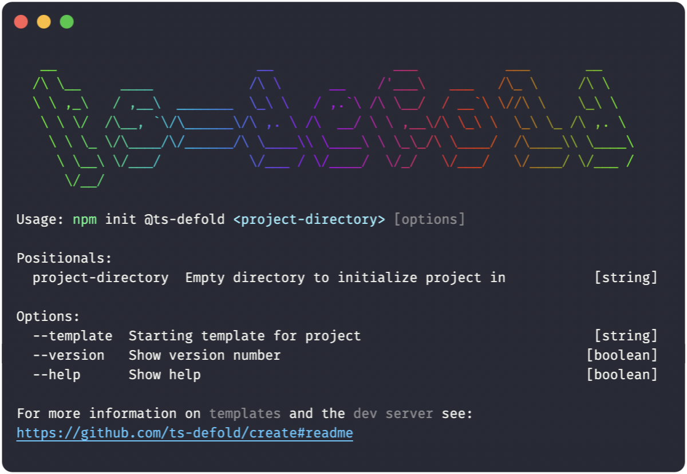

# @ts-defold/create
> npm init @ts-defold &lt;project-directory&gt;

<p align="center">
  
</p>

```sh
> npm init @ts-defold my-game --template war-battles
```
```sh
> npx @ts-defold/create my-game --serve
```
